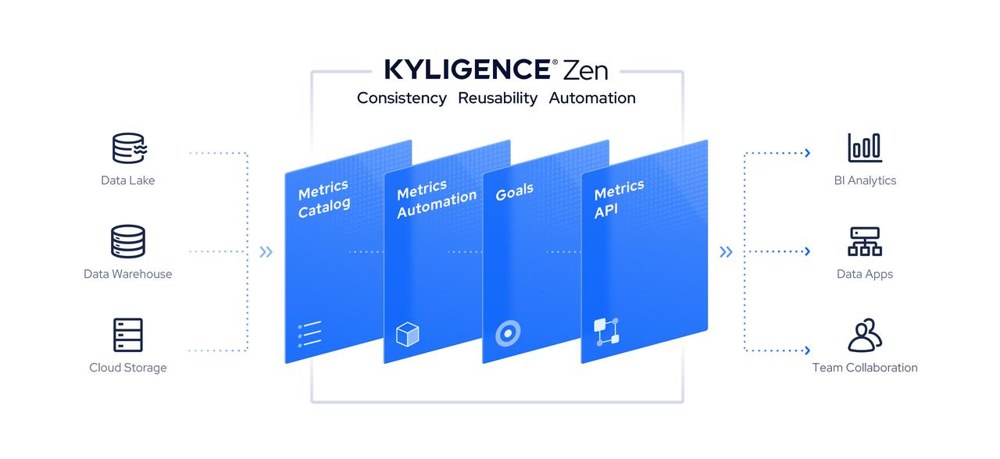

# Kyligence ZenMLToolkit

## ZenML

**ZenML** stands for **Zen Metrics Language**. It is a **YAML-based descriptive language** that is used
by [Kyligence Zen](https://kyligence.io/zen) to define `metrics`, `dimensions`, and
the `underlying relational datasets`. Think of ZenML as a semantic layer that promotes technical
data into business data, like a bridge that enables non-technical users to understand, explore, and get insight out of
traditional data warehouses. ZenML encourages the separation of data modeling and data visualization, and facilitates a
central definition of business data language for all downstream data consumers.

Kyligence Zen uses ZenML to store all metric definitions and their relations and mappings to relational data models.
With this metadata, Kyligence Zen is able to automatically translate all kinds of business requests and tasks into SQL
executions. A variety of data services are then provided around ZenML, including

- SQL based metric queries and BI integrations, via open APIs like JDBC / ODBC / RestAPI
- Metric templates of business domain know-hows
- Causal analysis, anomaly detection
- Goal management, progress tracking, and alerting
- Metrics data linage
- And more...

- You can also maintain ZenML/YAML files in git for version control, and publish (or rollback to) a certain version of
  metric definitions to Kyligence Zen service for business operation.

More details please refer to [ZenML Introduction](https://zen-docs.kyligence.io/en/appendix/zenml-reference)

## Kyligence Zen

[Kyligence Zen](https://kyligence.io/zen) is the **go-to low-code metrics platform** for businesses to get rid of the
limitations of BI reports and
achieve metrics-driven decision-making. Kyligence Zen centralizes scattered metrics in BI to a unified metrics platform,
saving you time and ensuring that all your metrics are managed and analyzed in one place.

With our cutting-edge technology, you can quickly connect your data sources, define your business metrics, and uncover
hidden insights in mere minutes. Our platform is designed to empower you to build a common data language across your
entire organization, streamlining your decision-making process and aligning your team around your most important
business goals. Plus, thanks to our intuitive drag-and-drop interface and ZenML(our Zen Metrics Language), Kyligence Zen
is accessible to both technical and non-technical users alike.



Try out Kyligence Zen today and take control of your metrics like never before!
Visit [zen.kyligence.io](https://kyligence.io/zen) to get started
for free.

## Kyligence ZenML Toolkit

Kyligence ZenML Toolkit is a toolkit which help users to extract metrics metadata from any type of file, includes but
not only:

- **SQL file (Implemented)**
    - `.sql`
- **Tableau (Implemented)**
    - workbook file (`.twb`)
    - datasource file(`.tds`)
- **Excel file(coming soon)**
    - `.xlsx`
- More...


### Prerequisite

- Supported OS:
    - Fully supports `Linux` / `MacOS`
- Supported JDK version: `JDK17`

### Download

Please go to [Release Page](https://github.com/Kyligence/zen-ml-toolkit/releases) to download.

If your environment has been setup jdk17, you can download this package:

- `Kyligence-ZenML-Toolkit-{version}.tar.gz`: Supports Linux and MacOS

Otherwise, you can download the package with embedded openjdk 17 according to your operating system:

- `Kyligence-ZenML-Toolkit-Linux-x64-{version}.tar.gz`: Supports Linux on X86
- `Kyligence-ZenML-Toolkit-Darwin-x64-{version}.tar.gz`: Supports MacOS on intel chipset
- `Kyligence-ZenML-Toolkit-Darwin-AArch64-{version}.tar.gz`: Supports MacOS on M series chipset

After downloaded package, extract the tar file

```
$ tar -zxvf Kyligence-ZenML-Toolkit-{version}.tar.gz
```

### Usage

- For **Command Line Interface**: please refer to [Usage of Command Line Interface](docs/cli.md)
- For **Server mode and REST API**: please refer to [Usage of Server Mode](docs/server.md)

### CLI Example

#### Convert tableau tds file to ZenML file

```
# please replace ${Kyligence-ZenML-Toolkit-{version}} with absolute path
$ cd ${Kyligence-ZenML-Toolkit-{version}}
$ sh ./bin/zen.sh -i ${Kyligence-ZenML-Toolkit-{version}}/samples/superstore.tds -o ${Kyligence-ZenML-Toolkit-{version}}/samples/
```

You will get a `superstore.zen.yml` file in folder `Kyligence-ZenML-Toolkit-{version}/samples`

#### Import ZenML to Kyligence Zen

1. Login into [Kyligence Zen](https://kyligence.io/zen)
2. Go to **Data**, click **New**, Choose **Table**
   
3. Choose upload csv, upload `orders.csv` file in folder `Kyligence-ZenML-Toolkit-{version}/samples`
   
4. You will create an `orders` table after you finished all steps in wizard
   
5. Go to **Metrics**, click **Import**
   
6. Import `superstore.zen.yml` file
   
7. All metrics defined in tableau tds file will be imported to Kyligence Zen
   

## Contribution
Welcome to contribute, you can convert any files which contains metrics metadata to a ZenML file.
Please refer to the [Dev Guide](docs/dev.md) to get the instruction for development.

## Contributors

<a href="https://github.com/Kyligence/zen-ml-toolkit/graphs/contributors">
  
</a>

Made with [contrib.rocks](https://contrib.rocks).

## Contact Kyligence

If you have requirements about

- Defining your metrics once in the metrics store
- Forming that single source of truth
- Consistently reuse the metrics across BI, automation tools, business workflows, or even advanced analytics

You can visit [kyligence.io/](https://kyligence.io/) to contact us to get more information.