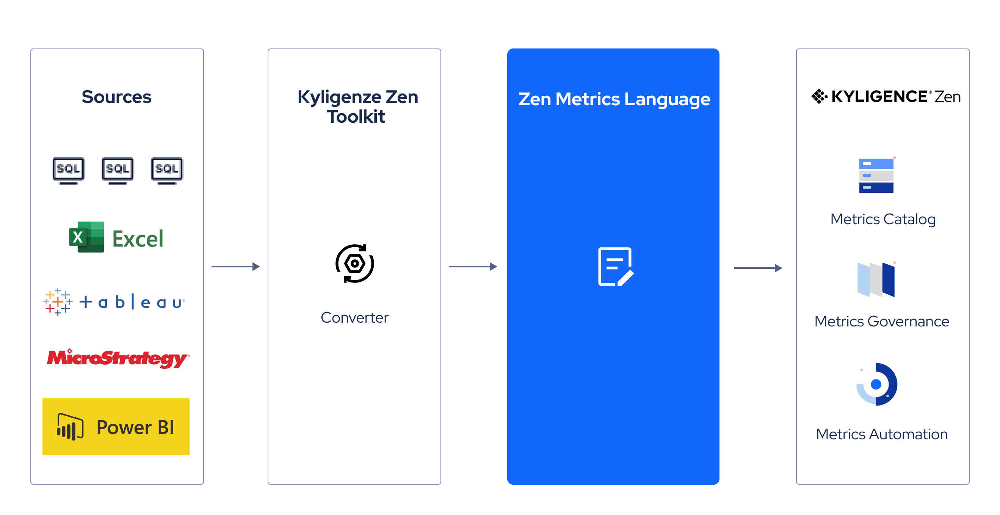
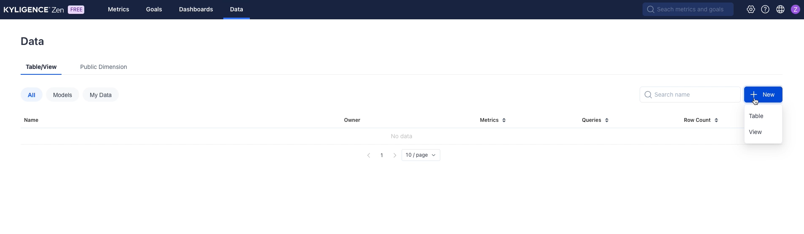
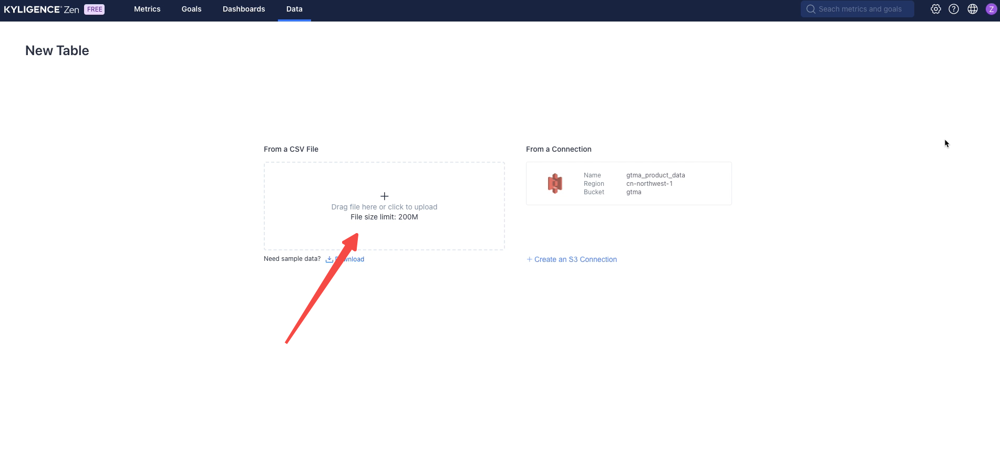
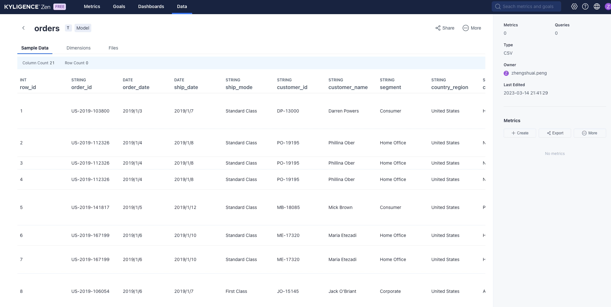
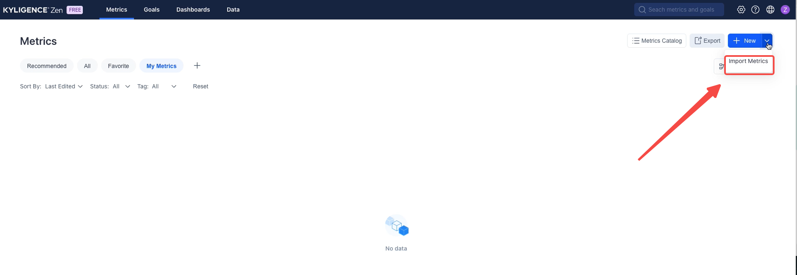
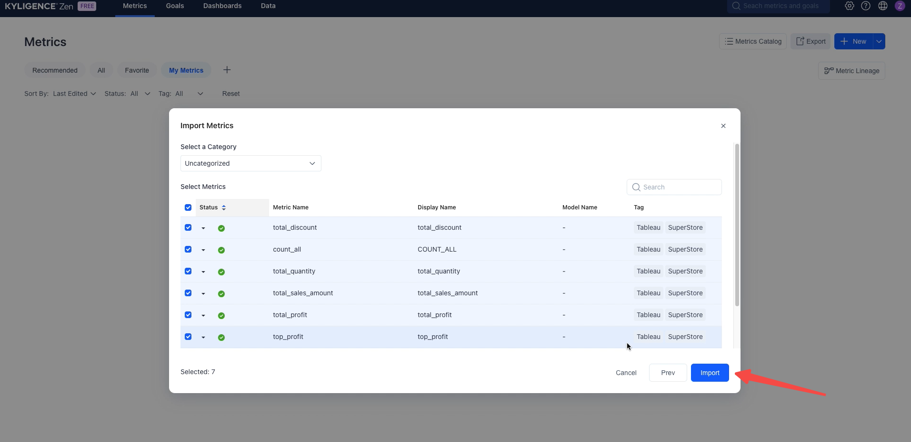
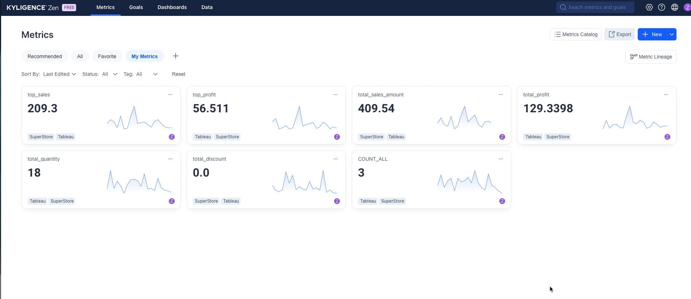

# Kyligence ZenMLToolkit

## ZenML

**ZenML** stands for **Zen Metrics Language**. It is a **YAML-based descriptive language** that is used
by [Kyligence Zen](https://zen.kyligence.io/)
to define metrics, dimensions, and the underlying relational datasets. Think of ZenML as a semantic layer that promotes
technical data into business data, like a bridge that enables non-technical users to understand, explore, and get
insight out of traditional data warehouses. ZenML encourages the separation of data modeling and data visualization, and
facilitates a central definition of business data language for all downstream data consumers.

Kyligence Zen uses ZenML to store all the metric definitions and related data models that user creates. And a variety of
data services are then provided around ZenML, including

- SQL based data queries and BI integrations, via open APIS like JDBC / ODBC / RestAPI
- Metrics templating of business domain know-how
- Goal management, progress tracking, and alerting
- Causal analysis, anomaly detection
- Metrics data linage
- And more...



## Kyligence Zen

[Kyligence Zen](https://zen.kyligence.io/) is the **go-to low-code metrics platform** for businesses to get rid of the
limitations of BI reports and
achieve metrics-driven decision-making. Kyligence Zen centralizes scattered metrics in BI to a unified metrics platform,
saving you time and ensuring that all your metrics are managed and analyzed in one place.

With our cutting-edge technology, you can quickly connect your data sources, define your business metrics, and uncover
hidden insights in mere minutes. Our platform is designed to empower you to build a common data language across your
entire organization, streamlining your decision-making process and aligning your team around your most important
business goals. Plus, thanks to our intuitive drag-and-drop interface and ZenML(our Zen Metrics Language), Kyligence Zen
is accessible to both technical and non-technical users alike.

Try out Kyligence Zen today and take control of your metrics like never before!
Visit [zen.kyligence.io](https://zen.kyligence.io/) to get started
for free.

## Prerequisite

- Supported OS: `Linux` / `MacOS`
- Supported JDK version: `JDK17`

## Download

Please go to [Release Page](https://github.com/Kyligence/zen-ml-toolkit/releases) to download.

If your environment has been setup jdk17, you can download this package:

- `Kyligence-ZenML-Toolkit-{version}.tar.gz`: Supports Linux and MacOS

Otherwise, you can download the package with embedded openjdk 17 according to your operating system:

- `Kyligence-ZenML-Toolkit-Linux-x64-{version}.tar.gz`: Supports Linux on X86
- `Kyligence-ZenML-Toolkit-Darwin-x64-{version}.tar.gz`: Supports MacOS on intel chipset
- `Kyligence-ZenML-Toolkit-Darwin-AArch64-{version}.tar.gz`: Supports MacOS on M series chipset

After downloaded package, extract the tar file

```
$ tar -zxvf Kyligence-ZenML-Toolkit-{version}.tar.gz
```

## Usage

in Terminal

```
usage:
$ sh ./bin/zen.sh -i <arg> -o <arg>
 -h,--help           print help message.
 -i,--in <arg>       specify the location of source file
 -o,--output <arg>   specify the output directory for metrics file
                     generated
```

## Example

### Convert tableau tds file to ZenML file

```
$ cd Kyligence-ZenML-Toolkit-{version}
$ sh ./bin/zen.sh -i ./samples/tableau/superstore.sh -o ./samples/tableau/
```

You will get a `superstore.zen.yml` file in folder `Kyligence-ZenML-Toolkit-{version}/samples`

### Import ZenML to Kyligence Zen

1. Login into [Kyligence Zen](https://zen.kyligence.io/)
2. Go to **Data**, click **New**, Choose **Table**
   
3. Choose upload csv, upload `orders.csv` file in folder `Kyligence-ZenML-Toolkit-{version}/samples`
   
4. You will create an `orders` table after you finished all steps in wizard
   
5. Go to **Metrics**, click **Import**
   
6. Import `superstore.zen.yml` file
   
7. All metrics defined in tableau tds file will be imported to Kyligence Zen
   

## Contribution

Welcome to contribute, you can convert any files which contains metrics metadata to a ZenML file.

## Contributors

<a href="https://github.com/Kyligence/zen-ml-toolkit/graphs/contributors">
  
</a>

Made with [contrib.rocks](https://contrib.rocks).