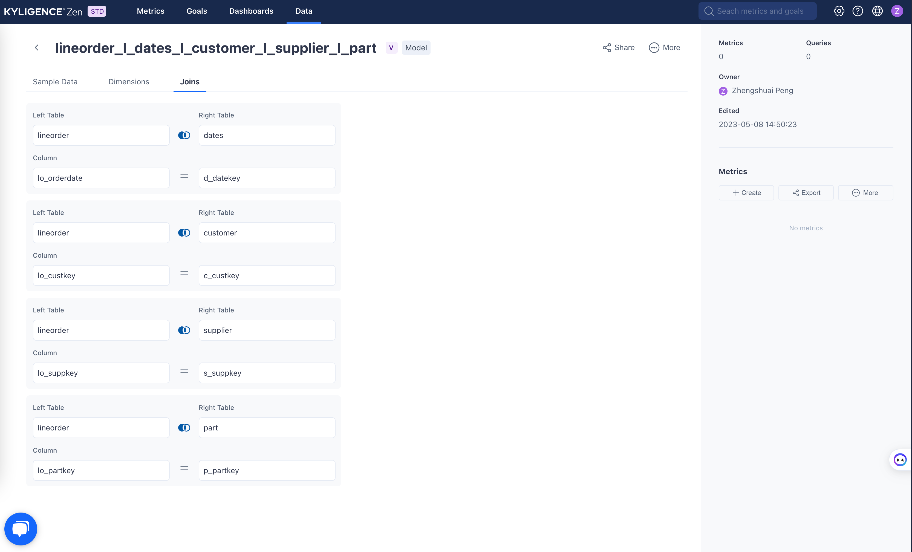

# Extract metrics from SQL List

### Usage

- For **Command Line Interface**: please refer to [Usage of Command Line Interface](cli.md)
- For **Server mode and REST API**: please refer to [Usage of Server Mode](server.md)

## Example

### Sample Dataset

Please visit `${Kyligence-ZenML-Toolkit-{version}}/samples/sql/` to get the SSB dataset with data csv files and a sql file


### Extract Metrics from SQLs to ZenML file

```
# please replace ${Kyligence-ZenML-Toolkit-{version}} with absolute path
$ cd ${Kyligence-ZenML-Toolkit-{version}}
$ sh ./bin/zen.sh -i ./samples/sql/ssb.sql -o ./samples/sql
```

You will get a `ssb.zen.yml` file in folder `Kyligence-ZenML-Toolkit-{version}/samples/sql`

### Import ZenML to Kyligence Zen

1. Login into [Kyligence Zen](https://kyligence.io/zen)
2. Go to **Data** Tab, upload SSB csv files to create tables
   
3. Create a view based on SSB tables `lineorder_l_dates_l_customer_l_supplier_l_part` as data model, the join key as list below
   
   
4. Go to **Metrics**, click **Import**, import `ssb.zen.yml` file
   
5. All metrics defined in sql file will be imported to Kyligence Zen
   

## Implementation

### Extract the metrics metadata from SQL
A SQL clause represents a query based on a data model, for example

```sql
select c_city, s_city, d_year, sum(lo_revenue) as lo_revenue
from lineorder
         left join dates on lo_orderdate = d_datekey
         left join customer on lo_custkey = c_custkey
         left join supplier on lo_suppkey = s_suppkey
where c_nation = 'UNITED STATES' and s_nation = 'UNITED STATES'
  and d_datekey >= '1992-01-01' and d_datekey <= '1997-01-01'
group by c_city, s_city, d_year
order by d_year asc, lo_revenue desc;
```

To extract the metrics from the SQL above, we need parse the SQL to SQLNode, and visit the SQL node to extract
- **Measure as Metrics Expression** 
  - The aggregation expression, `sum(lo_revenue)` 
- **Measure Alias Name as Metrics Name**
  - The alias of aggregation expression, `lo_revenue`
  - If a aggregation expression has no alias, will use the expression as the alias name
- **Column as Dimensions**
  - Columns exists in select list and where clause (intersection set)
    - Dimensions in select list: `c_city`, `s_city`, `d_year`
    - Dimensions in where clause: `c_nation`, `d_datekey`
- **Data Column as Time Dimensions**
  - Infer column data type in where clause to find `Date` columns as TimeDimension
  - The value of `d_datekey` is a date format `1992-01-01`, so it can be set as a time dimension
- **Join Relation as Data Model**
  - A join relation represents a data model
  - If a SQL has no join relation, the `From Table` will be named as the data model name
  - If a SQL has join tables, will generate the data model name follows the pattern `{Fact_Table}_{JoinType}_{Dim_Table}...`
  - `lineorder left join dates left join customer left join supplier` -> `lineorder_l_dates_customer_supplier`

### Merge metrics on same data model or with same measure expression

If there are two SQLs
```sql
--  SQL 1. table a join table_b 
select a, d, sum(b) from table_a 
left join table_b on a.bid = b.id;

-- SQL 2. table_a join table_b join table_c
select a, e, sum(b), sum(c) from table_a
left join table_b on a.bid = b.id
left join table c on a.cid = c.id;
```
3 metrics will be extracted:
- `sum(b)` on data model `table_a_l_table_b` with dimension `a, d`
- `sum(b)` on data model `table_a_l_table_b_l_table_c` with dimension `a, e`
- `sum(c)` on data model `table_a_l_table_b_l_table_c` with dimension `a, e`

The data model of the second SQL `table_a_l_table_b_l_table_c` "contains" the data model of first SQL `table_a_l_table_b`.
So these 3 metrics can be merged on the same data model
- `sum(b)` on data model `table_a_l_table_b_l_table_c` with dimension `a, d`
- `sum(b)` on data model `table_a_l_table_b_l_table_c` with dimension `a, e`
- `sum(c)` on data model `table_a_l_table_b_l_table_c` with dimension `a, e`

Then loop the metrics, merge the metrics with same **expression**, union the dimension list, the final results will be
- `sum(b)` on data model `table_a_l_table_b_l_table_c`, with dimension `a, d, e`
- `sum(c)` on data model `table_a_l_table_b_l_table_c`, with dimension `a, e`


## Notice
1. Supports SparkSQL compatible expression
2. Data model supports `left/inner` join type 


