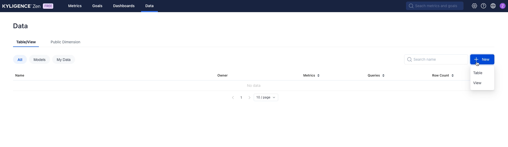
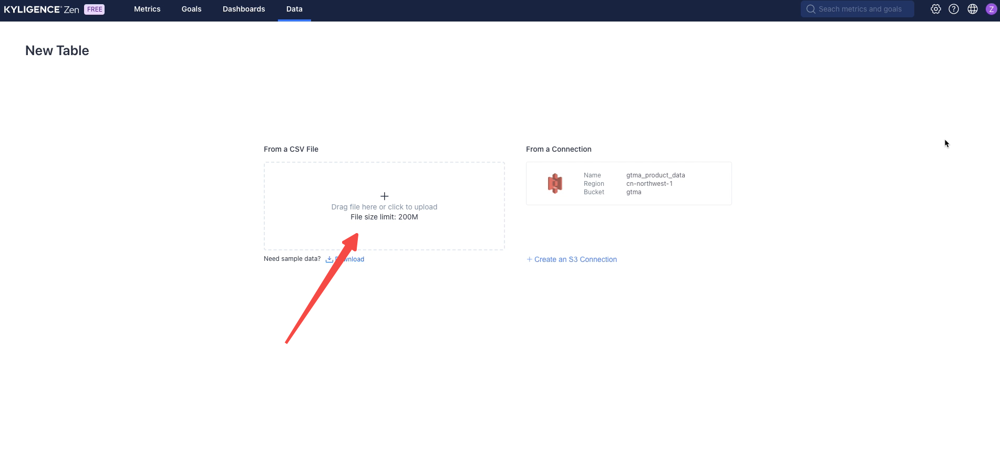
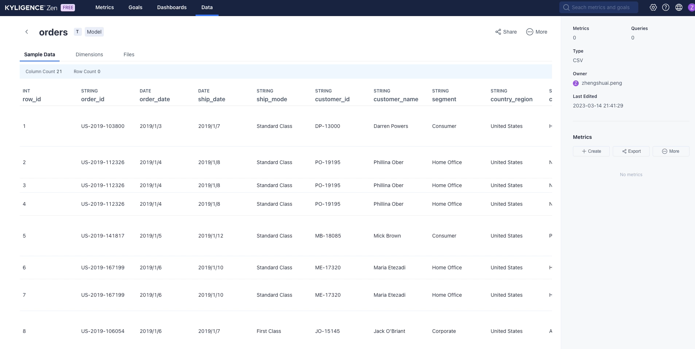
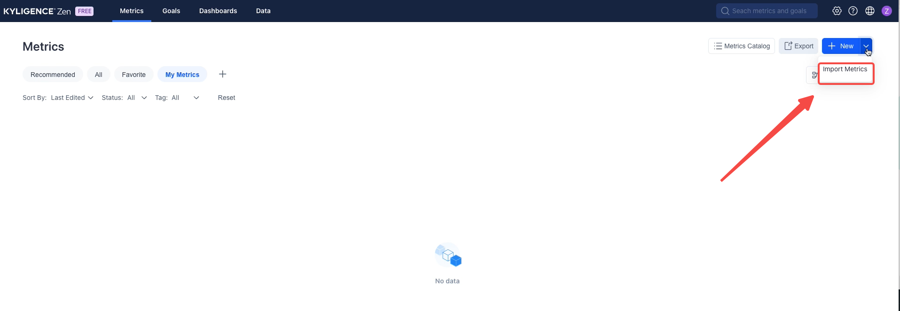
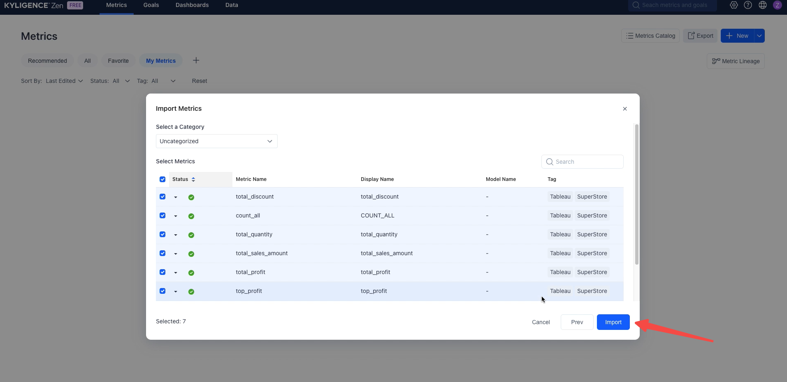
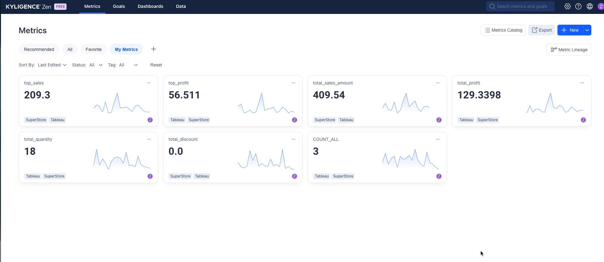

# Extract Tableau Calculated Field to Metrics

### Usage

- For **Command Line Interface**: please refer to [Usage of Command Line Interface](cli.md)
- For **Server mode and REST API**: please refer to [Usage of Server Mode](server.md)

## Example

### Sample Dataset

Please visit `${Kyligence-ZenML-Toolkit-{version}}/samples/tableau/` to get the data csv file and a tableau tds file

### Convert tableau tds file to ZenML file

```
# please replace ${Kyligence-ZenML-Toolkit-{version}} with absolute path
$ cd ${Kyligence-ZenML-Toolkit-{version}}
$ sh ./bin/zen.sh -i ./samples/tableau/superstore.tds -o ./samples/tableau
```

You will get a `superstore.zen.yml` file in folder `Kyligence-ZenML-Toolkit-{version}/samples/tableau`

### Import ZenML to Kyligence Zen

1. Login into [Kyligence Zen](https://kyligence.io/zen)
2. Go to **Data**, click **New**, Choose **Table**
   
3. Choose upload csv, upload `orders.csv` file in folder `Kyligence-ZenML-Toolkit-{version}/samples`
   
4. You will create an `orders` table after you finished all steps in wizard
   
5. Go to **Metrics**, click **Import**
   
6. Import `superstore.zen.yml` file
   
7. All metrics defined in tableau tds file will be imported to Kyligence Zen
   

## Implementation

1. Mapping the `TDS/TWB` file to data model objects 
2. Extract the metrics from Tableau Calculate field  
3. Data model name from tableau tds file 
   - If a metric refers the dimensions from more than 1 table, will use the tableau data source name as data model name
   - If a metric refers the dimensions from only 1 table, will use the table name as data model name
   - If a metric refers no dimensions, will use the tableau data source name as data model name

## Notice
1. **Not all expressions in tableau calculated fields can be supported in Kyligence Zen, only SQL compatible expressions supported**
2. Please make sure the **all identifiers(table_name, col_name) should be in lowercase**, and only contains letters, numbers and underscore 
